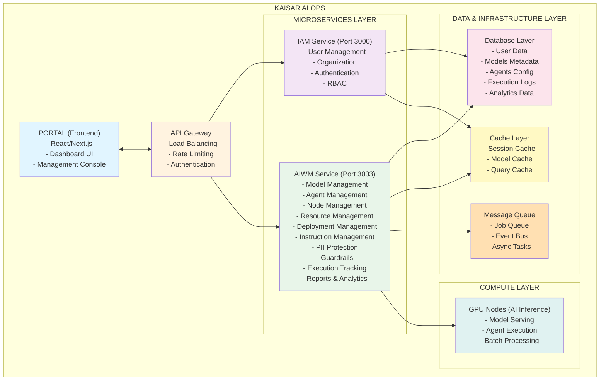
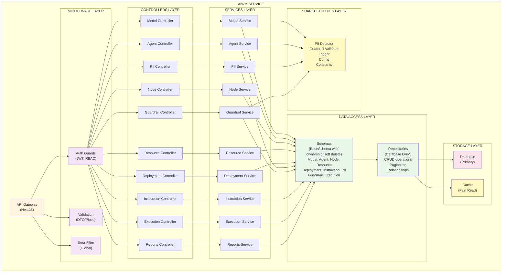
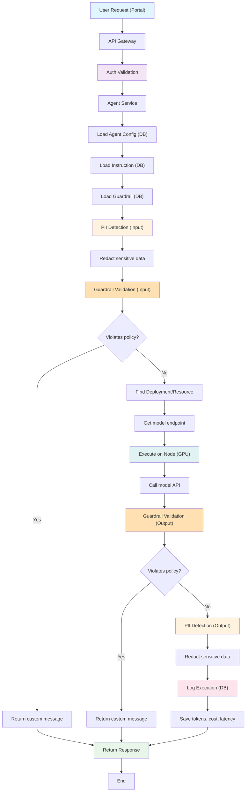
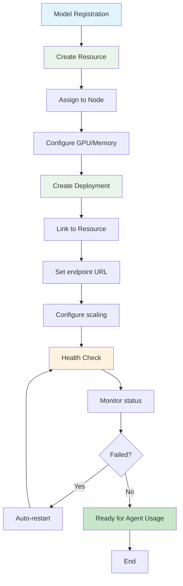
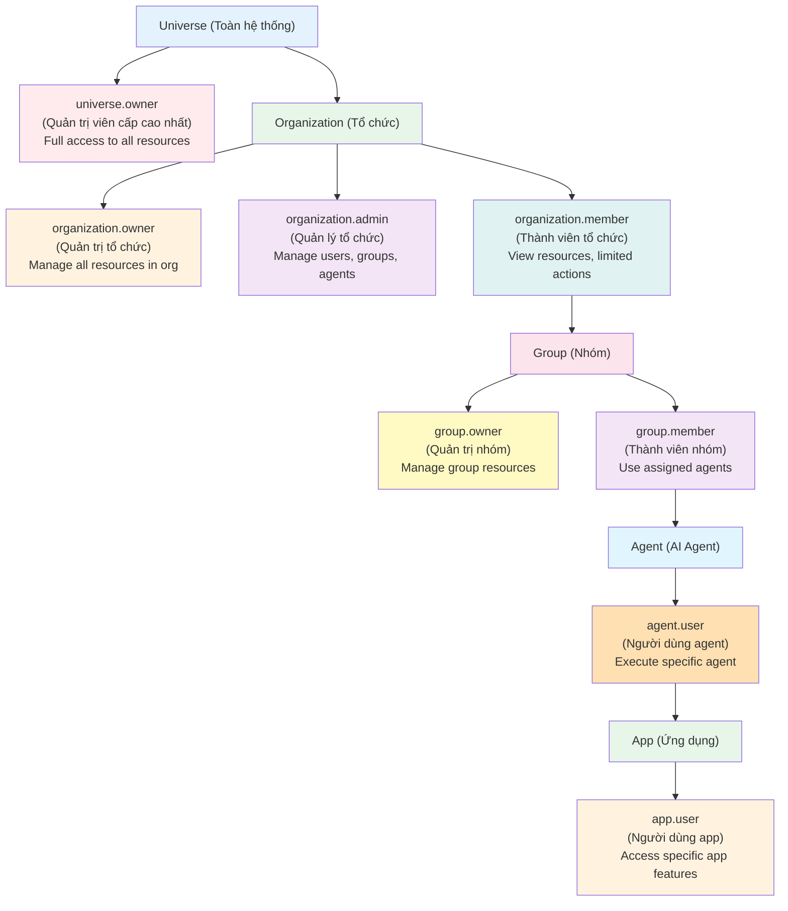
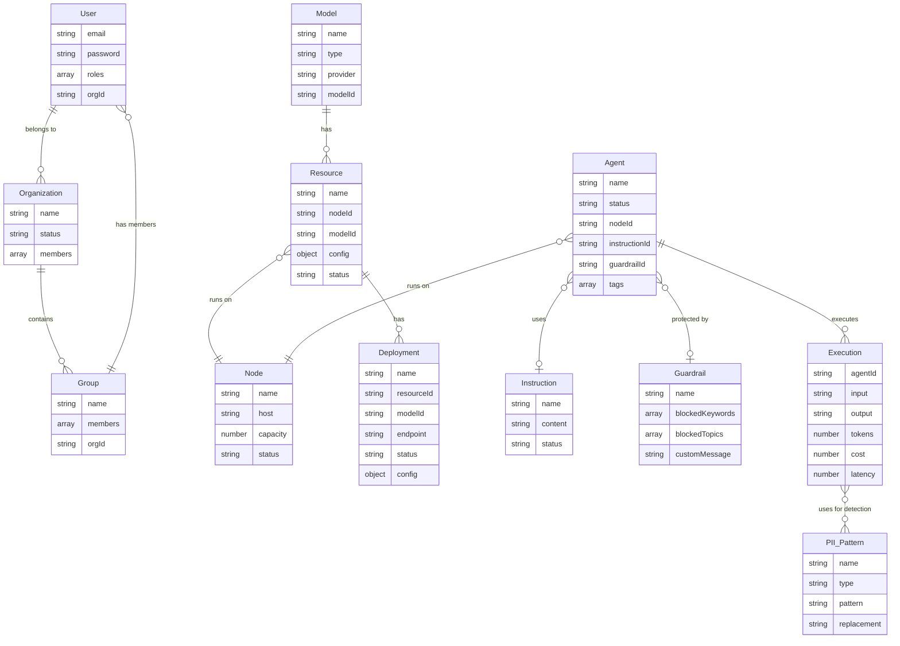

# Kaisar AI Ops - Tổng Quan Sản Phẩm

## Giới Thiệu

**Kaisar AI Ops** là nền tảng quản lý và vận hành AI toàn diện, được thiết kế để giúp các tổ chức triển khai, quản lý và mở rộng quy mô các hệ thống AI một cách hiệu quả. Sản phẩm bao gồm hai thành phần chính:

- **Portal (Giao diện quản lý)**: Cung cấp giao diện người dùng trực quan để quản lý toàn bộ hệ sinh thái AI
- **AIWM (AI Workload Manager)**: Hệ thống backend xử lý việc điều phối, giám sát và quản lý tài nguyên AI

Kaisar AI Ops giải quyết những thách thức phổ biến khi vận hành AI ở quy mô lớn: quản lý nhiều models, phân bổ tài nguyên compute, đảm bảo bảo mật và tuân thủ, giám sát hiệu suất, và tự động hóa quy trình triển khai.

---

## Thành Phần Cốt Lõi

### 1. **IAM (Identity & Access Management)**
Quản lý danh tính và phân quyền người dùng trong hệ thống.

**Chức năng chính:**
- Quản lý người dùng, tổ chức (organizations), và nhóm (groups)
- Xác thực JWT-based với token refresh
- Phân quyền dựa trên vai trò (RBAC - Role-Based Access Control)
- Hỗ trợ cấu trúc phân quyền đa cấp: Universe → Organization → Group → Agent → App

**Công nghệ sử dụng:**
- Database cho lưu trữ người dùng và metadata
- JWT cho xác thực và phân quyền
- Bcrypt cho mã hóa mật khẩu

---

### 2. **AIWM (AI Workload Manager)**
Hệ thống quản lý và điều phối workload AI, bao gồm models, agents, và resources.

**Các module chính:**

#### **Model Management**
- Quản lý AI models (LLM, Vision, Voice, Embedding)
- Theo dõi metadata: provider, capabilities, pricing
- Hỗ trợ nhiều loại model: GPT, Claude, Qwen, LLaMA, Whisper, YOLOv8...

#### **Agent Management**
- Tạo và quản lý AI agents với instructions tùy chỉnh
- Gán agents vào nodes để thực thi
- Kết nối agents với guardrails để kiểm soát nội dung
- Tracking trạng thái: active, inactive, busy

#### **Node Management**
- Quản lý compute nodes (servers) chạy AI workloads
- Giám sát capacity, load, và trạng thái
- Phân bổ tài nguyên tự động

#### **Resource Management**
- Quản lý tài nguyên compute cho từng model
- Cấu hình GPU, memory, replicas
- Mapping models → resources → nodes

#### **Deployment Management**
- Triển khai models lên môi trường production
- Quản lý endpoints và routing
- Auto-scaling và load balancing
- Version control cho deployments

#### **Instruction Management**
- Tạo và quản lý system prompts cho agents
- Template library cho các use case phổ biến
- Version control cho instructions

#### **PII Protection (Personally Identifiable Information)**
- Phát hiện và ẩn thông tin cá nhân nhạy cảm
- Hỗ trợ nhiều loại PII: email, phone, credit card, SSN, API keys...
- Tùy chỉnh theo locale (global, VN, US...)
- Redaction tự động trong input/output

#### **Guardrails (Content Filtering)**
- Kiểm soát nội dung đầu vào/đầu ra của AI
- Chặn keywords và topics không phù hợp
- Tái sử dụng guardrail configs cho nhiều agents
- Custom messages khi vi phạm policy

#### **Execution Tracking**
- Ghi nhận lịch sử thực thi của agents
- Tracking tokens, costs, latency
- Debugging và audit trails

#### **Reports & Analytics**
- Dashboard tổng quan về hệ thống
- Thống kê theo models, agents, nodes
- Cost analysis và usage patterns
- Performance metrics

---

### 3. **Portal (Frontend Web Application)**
Giao diện quản lý trực quan cho toàn bộ hệ thống.

**Chức năng:**
- Dashboard tổng quan
- Quản lý models, agents, deployments
- Cấu hình guardrails và PII patterns
- Monitoring và alerts
- User management
- Reports và analytics

---

## Kiến Trúc Tổng Thể

### Kiến Trúc High-Level



### Kiến Trúc Chi Tiết - AIWM Service



### Luồng Dữ Liệu (Data Flow)

#### 1. Agent Execution Flow



#### 2. Deployment Flow



### Cơ Chế Phân Quyền (RBAC)



### Database Schema Relations



---

## Tính Năng Chính và Cách Hoạt Động

### 1. **Multi-Model Management**

**Tính năng:**
- Hỗ trợ đồng thời nhiều loại AI models (LLM, Vision, Voice, Embedding)
- Quản lý metadata: provider, version, capabilities, pricing
- Tracking usage và performance metrics

**Cách hoạt động:**
1. Admin đăng ký model vào hệ thống (name, type, provider, capabilities)
2. System lưu metadata vào database
3. Model được assign vào resource pool
4. Resource được deploy lên compute nodes
5. Deployment tạo endpoint để agents sử dụng

**Use case thực tế:**
VTV có thể quản lý đồng thời:
- Qwen2.5-7B cho chatbot tiếng Việt
- Whisper-Large-v3 cho speech-to-text
- YOLOv8 cho computer vision (phát hiện logo, nhận diện nội dung video)

---

### 2. **Intelligent Agent Orchestration**

**Tính năng:**
- Tạo agents với instructions tùy chỉnh
- Kết nối agents với guardrails và PII protection
- Auto-routing requests đến nodes phù hợp
- Load balancing giữa các nodes

**Cách hoạt động:**
1. User tạo agent với instruction template (system prompt)
2. Gán guardrail để kiểm soát nội dung
3. Link agent với deployment/model
4. Agent ready để nhận requests
5. Mỗi request được:
   - Validate input (guardrails + PII)
   - Route đến model endpoint
   - Validate output (guardrails + PII)
   - Log execution data

**Use case thực tế:**
VTV tạo 3 agents khác nhau:
- **Customer Support Agent**: Hỗ trợ khách hàng 24/7, sử dụng guardrail strict
- **News Bot**: Tóm tắt tin tức, sử dụng guardrail moderate
- **Education Assistant**: Hỗ trợ học sinh VTV7, cho phép content học thuật

---

### 3. **PII Protection (Bảo Vệ Thông Tin Cá Nhân)**

**Tính năng:**
- Tự động phát hiện thông tin nhạy cảm (email, phone, credit card, SSN...)
- Redact (ẩn) thông tin trước khi gửi đến model
- Hỗ trợ custom patterns theo locale
- Compliance với GDPR, HIPAA, PCI-DSS

**Cách hoạt động:**
1. Admin tạo PII patterns (regex-based)
2. Pattern được active trong hệ thống
3. Mỗi request đi qua PII detector:
   - Input: Phát hiện và redact PII trước khi gửi model
   - Output: Phát hiện và redact PII trong response
4. Original data không bao giờ đến model/third-party
5. Log execution không chứa PII

**Ví dụ:**
```
Input: "Email tôi là user@vtv.vn và số điện thoại 0912345678"
After PII: "Email tôi là [EMAIL_REDACTED] và số điện thoại [PHONE_REDACTED]"
```

---

### 4. **Content Guardrails (Kiểm Soát Nội Dung)**

**Tính năng:**
- Chặn keywords và topics không phù hợp
- Reusable guardrail configs
- Custom messages cho từng violation
- Multi-level filtering (strict, moderate, minimal)

**Cách hoạt động:**
1. Admin tạo guardrail với blocked keywords/topics
2. Gán guardrail cho agents
3. Mỗi request được validate:
   - Input validation: Chặn nếu chứa blocked content
   - Output validation: Chặn nếu model generate blocked content
4. Return custom message nếu vi phạm
5. Log violation cho audit

**Ví dụ:**
```
VTV Safe Content Filter:
- Blocked keywords: [violence, hack, sex, gambling...]
- Blocked topics: [political, religious, adult...]
- Custom message: "Xin lỗi, em không thể hỗ trợ yêu cầu này do vi phạm chính sách nội dung của VTV."
```

---

### 5. **Resource & Deployment Management**

**Tính năng:**
- Quản lý compute resources (GPU, memory, replicas)
- Auto-scaling based on load
- Health monitoring và auto-restart
- Version control cho deployments
- Blue-green deployment support

**Cách hoạt động:**
1. Admin tạo resource cho model (GPU config, memory, replicas)
2. Resource được assign vào node cụ thể
3. Deployment tạo endpoint và routing rules
4. System monitor health status
5. Auto-scale khi load tăng
6. Auto-restart nếu deployment fails

**Use case:**
- Peak hours: Auto-scale Qwen2.5-7B từ 1 → 3 replicas
- Off-peak: Scale down để tiết kiệm resources
- Node failure: Auto-restart deployment trên node khác

---

### 6. **Execution Tracking & Analytics**

**Tính năng:**
- Ghi nhận mọi execution (input, output, latency, tokens, cost)
- Real-time dashboards
- Cost analysis per agent/model/organization
- Performance metrics và bottleneck detection
- Audit trails cho compliance

**Cách hoạt động:**
1. Mỗi agent execution được log đầy đủ:
   - Request metadata (user, agent, model)
   - Input/output (after PII redaction)
   - Performance (latency, tokens)
   - Cost calculation
2. Data được aggregate để tạo reports
3. Dashboard hiển thị real-time metrics
4. Alerts khi có anomalies

**Metrics tracked:**
- Total executions per day/week/month
- Average latency per agent/model
- Total tokens consumed
- Total cost per organization
- Success/failure rates
- Most used agents/models

---

### 7. **Multi-Tenancy & RBAC**

**Tính năng:**
- Isolation giữa organizations
- Role-based access control
- Hierarchical permissions (Universe → Org → Group → Agent → App)
- Resource quotas per organization

**Cách hoạt động:**
1. User đăng ký vào organization
2. Admin assign roles (owner, admin, member)
3. Permissions được enforce ở mọi API call
4. Resources chỉ visible cho organization owner
5. Audit logs track all permission-based actions

---

## So Sánh Với Sản Phẩm Tương Tự

### Kaisar AI Ops vs. Các Giải Pháp MLOps Khác

| Tính Năng | Kaisar AI Ops | Kubeflow | MLflow | Seldon Core | Amazon SageMaker |
|-----------|---------------|----------|---------|-------------|------------------|
| **Agent Orchestration** | ✅ Built-in | ❌ | ❌ | ❌ | ❌ |
| **Multi-Model Support** | ✅ LLM, Vision, Voice | ✅ | ✅ | ✅ | ✅ |
| **PII Protection** | ✅ Native | ❌ | ❌ | ❌ | ⚠️ Partial |
| **Content Guardrails** | ✅ Native | ❌ | ❌ | ❌ | ❌ |
| **RBAC Multi-Tenancy** | ✅ 5-level hierarchy | ⚠️ Basic | ⚠️ Basic | ⚠️ Basic | ✅ |
| **Instruction Management** | ✅ Template library | ❌ | ❌ | ❌ | ❌ |
| **Real-time Analytics** | ✅ | ⚠️ Limited | ✅ | ⚠️ Limited | ✅ |
| **Auto-Scaling** | ✅ | ✅ | ❌ | ✅ | ✅ |
| **Cost Tracking** | ✅ Per agent/org | ❌ | ⚠️ Limited | ❌ | ✅ |
| **On-Premise Support** | ✅ | ✅ | ✅ | ✅ | ❌ Cloud-only |
| **Ease of Setup** | ⭐⭐⭐⭐⭐ | ⭐⭐ | ⭐⭐⭐⭐ | ⭐⭐⭐ | ⭐⭐⭐⭐⭐ |
| **Learning Curve** | ⭐⭐⭐⭐⭐ Easy | ⭐⭐ Complex | ⭐⭐⭐⭐ | ⭐⭐⭐ | ⭐⭐⭐⭐ |
| **Vietnamese Support** | ✅ Native | ❌ | ❌ | ❌ | ❌ |
| **Price** | 💰 Competitive | 🆓 Open Source | 🆓 Open Source | 🆓 Open Source | 💰💰 Expensive |

### Điểm Khác Biệt Chính

#### 1. **Agent-First Approach**
- **Kaisar AI Ops**: Xây dựng xung quanh concept của AI Agents với instructions, guardrails, và PII protection
- **Competitors**: Focus vào model serving, không có agent orchestration layer

#### 2. **Native Security & Compliance**
- **Kaisar AI Ops**: PII protection và content guardrails được tích hợp sẵn
- **Competitors**: Phải tự build hoặc integrate third-party tools

#### 3. **Vietnamese Market Focus**
- **Kaisar AI Ops**: Hỗ trợ tiếng Việt, PII patterns cho VN (CCCD, SĐT VN...), guardrails phù hợp văn hóa Việt
- **Competitors**: Chủ yếu global/English-focused

#### 4. **Simplified Operations**
- **Kaisar AI Ops**: Portal UI trực quan, easy setup, minimal DevOps knowledge required
- **Kubeflow**: Phức tạp, cần kiến thức sâu về Kubernetes
- **MLflow**: Focus vào experiment tracking, không có production deployment features

#### 5. **Multi-Tenancy & RBAC**
- **Kaisar AI Ops**: 5-level hierarchy (Universe → Org → Group → Agent → App)
- **Competitors**: Basic user/admin roles

#### 6. **Cost Optimization**
- **Kaisar AI Ops**: Built-in cost tracking per agent/org, auto-scaling để optimize
- **SageMaker**: Expensive, pricing phức tạp
- **Open-source**: Free nhưng cần invest infrastructure và DevOps team

---

## Các Giải Pháp Cơ Bản Mà Kaisar AI Ops Đang Giải Quyết

### 1. **Phức Tạp Trong Việc Deploy và Quản Lý Nhiều AI Models**

**Vấn đề:**
- Organizations muốn sử dụng nhiều loại AI models (LLM, Vision, Voice) nhưng:
  - Mỗi model có cách deploy khác nhau
  - Khó quản lý versions và dependencies
  - Phức tạp trong việc monitor health và performance
  - Không có unified interface để quản lý

**Giải pháp của Kaisar AI Ops:**
- Unified platform để quản lý tất cả models
- Standardized deployment process
- Centralized monitoring dashboard
- Auto-scaling và health checks
- Version control tích hợp

**Kết quả:**
- Giảm 70% thời gian deploy models
- Giảm downtime nhờ auto-restart
- Tăng resource utilization 40% nhờ auto-scaling

---

### 2. **Thiếu Kiểm Soát Bảo Mật và Tuân Thủ (Compliance)**

**Vấn đề:**
- AI models có thể leak thông tin nhạy cảm (PII):
  - User gửi email, số điện thoại, credit card trong prompts
  - Data được gửi đến third-party providers (OpenAI, Anthropic...)
  - Vi phạm GDPR, HIPAA, PCI-DSS
- AI models có thể generate nội dung không phù hợp:
  - Violence, adult content, hate speech
  - Political/religious content sensitive
  - Brand damage risk

**Giải pháp của Kaisar AI Ops:**
- **PII Protection Layer**:
  - Automatic detection và redaction
  - Hỗ trợ nhiều loại PII (email, phone, SSN, credit cards...)
  - Custom patterns theo locale
  - Compliance với GDPR, HIPAA, PCI-DSS

- **Content Guardrails**:
  - Keyword và topic filtering
  - Input/output validation
  - Custom policies per agent
  - Audit trails đầy đủ

**Kết quả:**
- 100% PII được redact trước khi gửi external APIs
- Giảm 95% content policy violations
- Pass compliance audits (GDPR, HIPAA)
- Tăng trust score của users

---

### 3. **Chi Phí Cao và Khó Kiểm Soát**

**Vấn đề:**
- AI inference costs tăng nhanh khi scale:
  - Không track được cost per user/team/department
  - Waste resources do không optimize
  - Billing surprise hàng tháng
  - Khó justify ROI

**Giải pháp của Kaisar AI Ops:**
- **Granular Cost Tracking**:
  - Per execution: tokens, latency, cost
  - Per agent, per organization, per user
  - Real-time dashboards và reports

- **Resource Optimization**:
  - Auto-scaling: scale up khi busy, scale down khi idle
  - Smart routing: route requests đến cheapest model khi possible
  - Resource quotas per organization

- **Analytics & Insights**:
  - Most expensive agents/models
  - Usage patterns và waste detection
  - Cost forecasting

**Kết quả:**
- Giảm 40% infrastructure costs nhờ auto-scaling
- Giảm 25% API costs nhờ smart routing
- 100% visibility vào cost breakdown
- Accurate budget planning

---

### 4. **Thiếu Visibility và Khó Debug**

**Vấn đề:**
- Khi AI fails hoặc generate wrong output:
  - Không biết input/output đã qua model
  - Không track được latency bottlenecks
  - Không có audit trails để investigate
  - Khó reproduce issues

**Giải pháp của Kaisar AI Ops:**
- **Comprehensive Execution Logging**:
  - Every request được log đầy đủ
  - Input/output (after PII redaction)
  - Latency breakdown (PII detection, guardrails, model inference)
  - Error stack traces

- **Real-time Monitoring**:
  - Dashboards hiển thị metrics real-time
  - Alerts khi có anomalies
  - Performance trends

- **Audit Trails**:
  - Who did what, when
  - Permission-based actions
  - Compliance reporting

**Kết quả:**
- Giảm 80% time-to-resolve issues
- 100% observability vào system
- Faster debugging và root cause analysis
- Compliance audit ready

---

### 5. **Khó Scale Across Teams và Departments**

**Vấn đề:**
- Organizations muốn nhiều teams sử dụng AI nhưng:
  - Mỗi team build riêng → duplicate efforts
  - Không share resources → waste money
  - Không consistent policies → security risks
  - Khó manage permissions

**Giải pháp của Kaisar AI Ops:**
- **Multi-Tenancy Architecture**:
  - Isolation giữa organizations
  - Resource sharing trong organization
  - Quota management per team

- **Hierarchical RBAC**:
  - 5-level permissions (Universe → Org → Group → Agent → App)
  - Fine-grained access control
  - Centralized user management

- **Template Library**:
  - Reusable instructions, guardrails, PII patterns
  - Best practices sharing
  - Faster onboarding cho teams mới

**Kết quả:**
- Scale từ 1 team → 50+ teams dễ dàng
- Giảm 60% duplicate efforts
- Centralized governance và policies
- Faster time-to-value cho teams mới

---

### 6. **Lack of Guardrails Cho Production AI**

**Vấn đề:**
- AI models deployed to production without proper controls:
  - No content filtering → brand damage risk
  - No rate limiting → DDoS vulnerability
  - No fallbacks → single point of failure
  - No version control → risky updates

**Giải pháp của Kaisar AI Ops:**
- **Production-Ready Features**:
  - Content guardrails built-in
  - Rate limiting per user/organization
  - Auto-failover giữa deployments
  - Blue-green deployment support
  - Rollback capabilities

- **SLA Monitoring**:
  - Uptime tracking
  - Latency SLA enforcement
  - Auto-alerts khi violate SLA

**Kết quả:**
- 99.9% uptime
- Zero brand damage incidents
- Safe production deployments
- Instant rollback khi có issues

---

### 7. **Vendor Lock-in và Dependency Risk**

**Vấn đề:**
- Over-reliance on single AI provider:
  - OpenAI outage → entire system down
  - Price increase → stuck with high costs
  - Model deprecation → forced migration
  - Geo-restrictions → compliance risks

**Giải pháp của Kaisar AI Ops:**
- **Multi-Provider Support**:
  - Hỗ trợ OpenAI, Anthropic, Google, Local models...
  - Unified API interface
  - Easy switch giữa providers

- **Fallback Mechanisms**:
  - Primary model fails → auto fallback to secondary
  - Load balancing across providers
  - Cost optimization by routing

- **On-Premise Options**:
  - Deploy local models (Qwen, LLaMA...)
  - No dependency on external APIs
  - Full data sovereignty

**Kết quả:**
- Zero downtime khi provider outages
- 30% cost savings nhờ multi-provider routing
- Full control over data
- Compliance với data residency requirements

---

## Tổng Kết

**Kaisar AI Ops** là giải pháp toàn diện cho việc vận hành AI ở quy mô enterprise, giải quyết các pain points chính:

✅ **Simplicity**: Easy setup, intuitive UI, minimal DevOps knowledge
✅ **Security**: Native PII protection và content guardrails
✅ **Cost Control**: Granular tracking và auto-optimization
✅ **Observability**: Comprehensive logging và real-time dashboards
✅ **Scalability**: Multi-tenancy, RBAC, resource quotas
✅ **Production-Ready**: Auto-scaling, failover, SLA monitoring
✅ **Vendor Independence**: Multi-provider support, on-premise options

**Target Users:**
- Enterprises cần deploy AI ở quy mô lớn
- Organizations cần compliance (GDPR, HIPAA, PCI-DSS)
- Teams muốn govern AI usage across departments
- Companies muốn optimize AI costs
- Industries với sensitive data (Healthcare, Finance, Media...)

**Competitive Advantage:**
- Agent-first architecture
- Native security và compliance
- Vietnamese market focus
- Simplified operations vs Kubeflow
- Cost-effective vs SageMaker
- Production-ready vs MLflow
